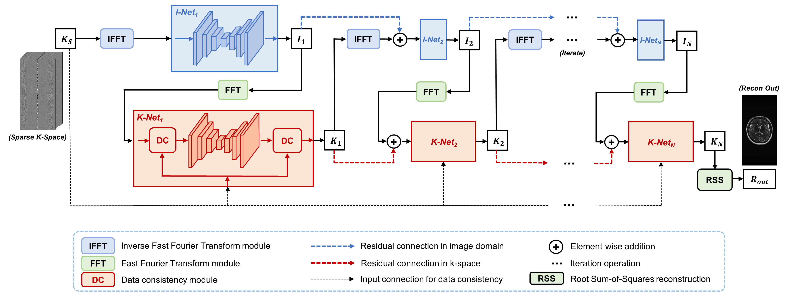

# DD-IRSENet: Dual-domain Iterative residual sqeze-excitaton network for sparse-view reconstruction of MRI

Xiongchao Chen, Zhigang Peng



This repository contains the PyTorch implementation of Dual-domain Iterative residual sqeze-excitaton network for sparse-view reconstruction of MRI

### Citation
If you use this code for your research or project, please cite: \
\
"..."

 ### Environment and Dependencies
 Requirements:
 * Python 3.8.13
 * PyTorch 1.11.0
 * numpy 1.22.3
 * tqdm 4.64.0
 * opencv 4.4.0
 * scikit-image 0.17.2
 * hypy 3.1.0
 * pyyaml 6.0

Our code has been tested with Python 3.8.13, PyTorch 1.11.0, CUDA: 10.0.130 on Ubuntu 18.04.6 

### Dataset Setup
    .
    Data
    ├── train_480                # contain training files
    |   ├── recon_001.h5
    |       ├── kspace.mat  
    |       ├── kspace_sv.mat
    |       ├── recon_origin.mat
    |       ├── recon_origin_sv.mat
    |       ├── mask.mat
    |       ├── recon_rss.mat
    |       ├── recon_rss_sv.mat
    |   └── ...  
    |
    ├── valid                # contain validation files
    |   ├── recon_001.h5
    |       ├── kspace.mat  
    |       ├── kspace_sv.mat
    |       ├── recon_origin.mat
    |       ├── recon_origin_sv.mat
    |       ├── mask.mat
    |       ├── recon_rss.mat
    |       ├── recon_rss_sv.mat
    |   └── ... 
    |
    └── test                 # contain testing files
    |   ├── recon_001.h5
    |       ├── kspace.mat  
    |       ├── kspace_sv.mat
    |       ├── recon_origin.mat
    |       ├── recon_origin_sv.mat
    |       ├── mask.mat
    |       ├── recon_rss.mat
    |       ├── recon_rss_sv.mat
    |   └── ... 
    └── ...  
 
 where \
`kspace`: full-view kspace data with a size of Num x W x H. \
`kspace_sv`: downsampled sparse-view kspace data with a size of Num x W x H. \
`recon_origin`: iverse fourier transfrom of 'kspace' with a size of Num x W x H. \
`recon_origin_sv`: iverse fourier transfrom of 'kspace_sv' with a size of Num x W x H. \
`mask`: downsampling mask of the sparse-view kspace data with a size of Num x W x H. \
`recon_rss`: root sum-of-square (RSS) reconstruction of 'recon_origin' with a size of W x H. \
`recon_rss_sv`: root sum-of-square (RSS) reconstruction of 'recon_origin_sv' with a size of W x H. 

### To Run the Code
Sample training/testing scripts are provided at the root folder as `train.sh` and `train.sh`.

- Train the model 
```bash
python train.py --experiment_name 'train_IRSENet_1' --data_root '../../Data/Data_ArrangeRecon/' --model_type 'model_cnn' --net_G 'DuRDN' --norm 'BN' --n_filters 16 --growth_rate 16 --n_denselayer 3 --n_channels 32 --lr_I1 5e-4 --lr_K1 5e-4 --lr_I2 5e-4 --lr_K2 5e-4 --n_epochs 600 --batch_size 2 --eval_epochs 5 --snapshot_epochs 5 --num_workers 0 --gpu_ids 0
```

where \
`--experiment_name` experiment name for the code, and save all the training results in this under this "experiment_name" folder. \
`--data_root`: path of the dataset. \
`--model_type`: model type used (default convolutioanl neural networks -- "model_cnn"). \
`--net_G`: neural network model used (default: 'DuRegister_DuSE'). \ 
`--norm`: normalization (default: 'BN' for Batch Normalization). \
`--n_filters`: number of filters in the dense connected layers (default: 16). \
`--growth_rate`: number of expanded channels in the dense connected layers (default: 16). \
`--n_denselayer`: number of dense layers. \
`--n_channels`: number of input channels. \
`--lr_I1`: learning rate of the Image-Net in the 1<sup>st</sup> iteration. \
`--lr_K1`: learning rate of the Kspace-Net in the 1<sup>st</sup> iteration. \
`--lr_I2`: learning rate of the Image-Net in the 2<sup>nd</sup> iteration. \
`--lr_K2`: learning rate of the Kspace-Net in the 2<sup>nd</sup> iteration. \
`--n_epochs`: num of epoches of training. \
`--batch_size`: training batch size. \
`--gpu_ids`: GPU configuration.


- Test the model
```bash
python test.py --resume './outputs/train_IRSENet_1/checkpoints/model_399.pt' --experiment_name 'test_IRSENet_1_399' --data_root '../../Data/Data_ArrangeRecon/' --model_type 'model_cnn' --net_G 'DuRDN' --norm 'BN' --n_filters 16 --growth_rate 16 --n_denselayer 3 --n_channels 32 --eval_epochs 5 --snapshot_epochs 5 --num_workers 0 --gpu_ids 0
```

where \
where \
`--resume`: path of the model to be tested. \
`--resume_epoch`: training epoch of the model to be tested. \
`--experiment_name`: experiment name for the code, and save all the testing results in this under this "experiment_name" folder. 

### Data Avaliability
The acquisition of the deidentified [fastMRI Dataset][1] was conducted retrospectively using human subject data, made available in open access by Center for Advanced Imaging Innovation and Research (CAI<sup>2</sup>R), in the Department of Radiology at NYU School of Medicine and NYU Langone Health. Curation of these data are part of an IRB approved study.


### Contact 
If you have any question, please file an issue or directly contact the author:
```
Xiongchao Chen: xiongchao.chen@yale.edu, cxiongchao9587@gmail.com
```


<!-- Reference -->
[1]: https://fastmri.org/dataset/


 
 
